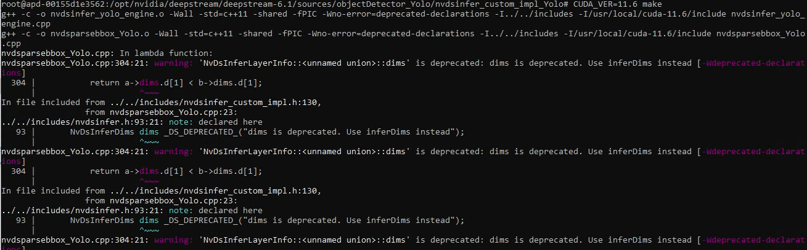
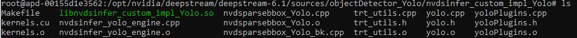

## Goal
The goal of the lab1 is to guide you to complile the updated nvdsparsebbox_Yolo.cpp for your custom vision model and your version of DeepStream.

## Steps

### Step 1: Create the deepstream environment 
1. google "Ngc nvidia"
2. Open the terminal
```
docker run --gpus all -it --rm --net=host --privileged -v /tmp/.X11-unix:/tmp/.X11-unix -e DISPLAY=$DISPLAY -w /opt/nvidia/deepstream/deepstream-6.1 nvcr.io/nvidia/deepstream:6.1-devel
```

### Step 2: Download the updated nvdsparsebbox_Yolo.cpp
1. cd to the nvdsinfer_custom_impl_Yolo folder
```
cd sources/objectDetector_Yolo/nvdsinfer_custom_impl_Yolo
```
2. Backup the original nvdsparsebbox_Yolo.cpp file
```
mv nvdsparsebbox_Yolo.cpp nvdsparsebbox_Yolo_bk.cpp
```
3. Download the updated nvdsparsebbox_Yolo.cpp
```
wget https://leannazdeepstream.blob.core.windows.net/learningseries/nvdsparsebbox_Yolo.cpp
```

### Step 3: Compile the updated nvdsparsebbox_Yolo.cpp and get the parser library 

1. Compile nvdsparsebbox_Yolo.cpp
```
CUDA_VER=<Your CUDA Version> make
```


1. List the files to check if the parser library `libnvdsinfer_custom_impl_Yolo` has been generated
```
ls
```



### Step 4: Copy the generated parser library out from the container
1. Open another terminal
2. Check the container ID 
```
docker ps
```
3. Copy the parser library out from the container to your host machine 
```
docker cp <container ID>:/opt/nvidia/deepstream/deepstream-6.1/sources/objectDetector_Yolo/nvdsinfer_custom_impl_Yolo/libnvdsinfer_custom_impl_Yolo.so libnvdsinfer_custom_impl_Yolo.so
```
4. Copy the file from the host to the jump server
```
scp leann@172.23.30.55:/home/leann/libnvdsinfer_custom_impl_Yolo.so libnvdsinfer_custom_impl_Yolo.so
```

## Links
1. [Updated nvdsparsebbox_Yolo.cpp for Custom Vision](https://github.com/Azure-Samples/NVIDIA-Deepstream-Azure-IoT-Edge-on-a-NVIDIA-Jetson-Nano/tree/master/DeepstreamOnIoTEdge/modules/NVIDIADeepStreamSDK/libnvdsinfer_custom_impl_Yolo)
2. [Original version of nvdsparsebbox_Yolo.cpp](https://github.com/Tianxiaomo/pytorch-YOLOv4/blob/master/DeepStream/nvdsinfer_custom_impl_Yolo/nvdsparsebbox_Yolo.cpp)

