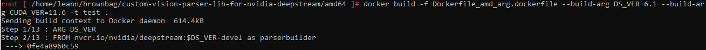
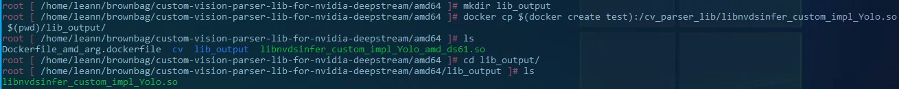

## Goal
The goal of this repo is to be able to generate the custom vision parser library automatically according to your CUDA version and Deepstream Version.

## Steps

### Step 1: Clone the repo
1. Open the terminal
```
git clone https://github.com/leannhuang/custom-vision-parser-lib-for-nvidia-deepstream.git
```

### Step 2: Build the docker image and generate the parser library
1. Docker build with the Deepstream version(DS_VER) and CUDA version(CUDA_VER) you set
```
docker build -f Dockerfile_amd_arg.dockerfile --build-arg DS_VER=6.1 --build-arg CUDA_VER=11.6 -t test . 
```



### Step 3: Copy the parser library generated from the image to the host

1. Make a new folder to put the library
```
mkdir lib_output
```


2. Copy the file `libnvdsinfer_custom_impl_Yolo` from the image to the host
```
docker cp $(docker create test):/cv_parser_lib/libnvdsinfer_custom_impl_Yolo.so $(pwd)/lib_output/
```

## Links
1. [Generate parser library for custom vision and deepstream](https://github.com/leannhuang/custom-vision-parser-lib-for-nvidia-deepstream)


