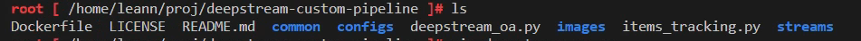
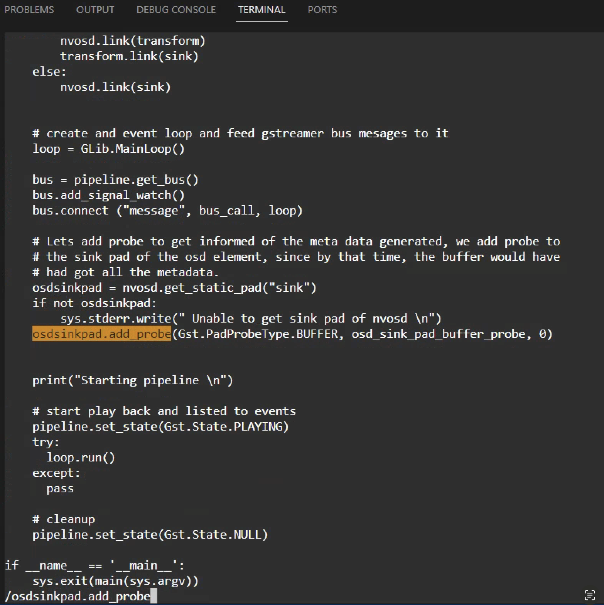
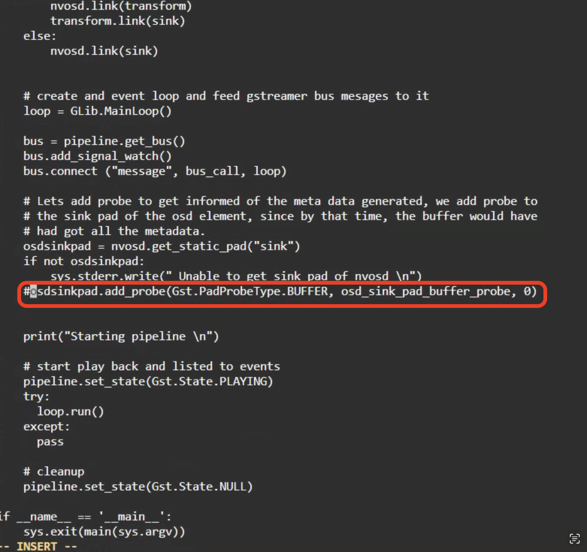
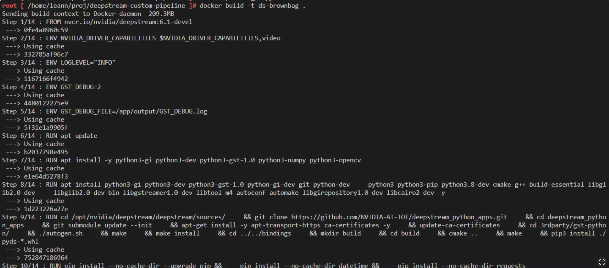
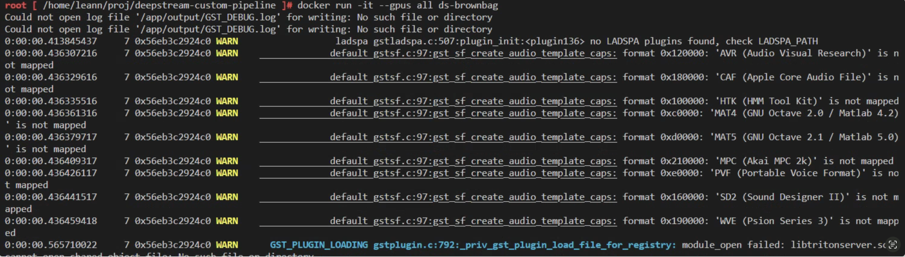
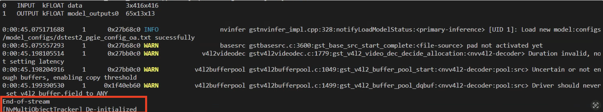

## Goal
The goal of the lab1 is to guide you to run a DeepStream custom pipeline.

## Steps

### Step 1: Clone the repo 
1. Open the terminal
```
git clone https://github.com/leannhuang/deepstream-custom-pipeline.git
```
2. cd to the cloned folder
```
cd deepstream-custom-pipeline/
```  
3. check the files inside the folder
```
ls
```


### Step 2: Comment out the code of adding the probe in the deepstream_oa.py
1. Edit deepstream_oa.py
```
vim deepstream_oa.py
```
2. Find the line "osdsinkpad.add_probe"


3. Comment out this line



### Ste p3: Build the docker image and run the container
1. build the docker image
```
docker build -t ds-brownbag .
```


2. Start running the container  
```
docker run -it --gpus all ds-brownbag
```


3. Completed!


## Links
1. [Pad directions](https://gstreamer.freedesktop.org/documentation/application-development/basics/pads.html?gi-language=c)
2. [DeepStream pre-build pipeline elements](https://docs.nvidia.com/metropolis/deepstream/dev-guide/text/DS_ref_app_deepstream.html)
   

